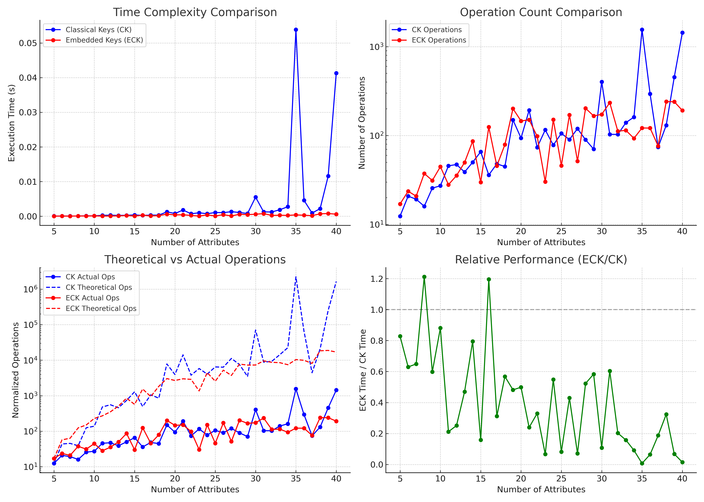
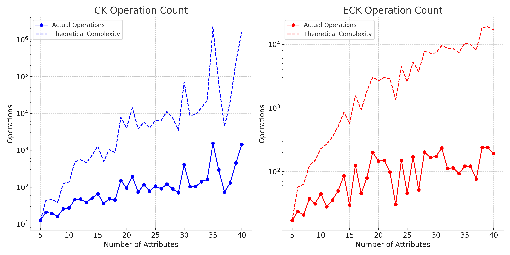
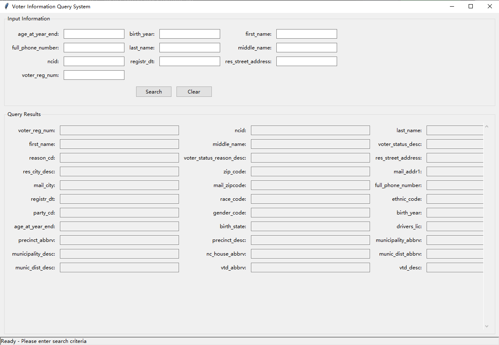

# Computing-All-Embedded-Candidate-Keys
# Embedded Candidate Key Discovery and Performance Analysis

This repository implements and compares two algorithms for candidate key discovery in relational schemas:

- The **Classical Candidate Key (CK)** algorithm based on the Lucchesi–Osborn enumeration strategy.
- The **Embedded Candidate Key (ECK)** algorithm, which extends key discovery to support partial schemas, missing values, and embedded constraints (eFDs and eUCs).

---

## Features

- Implementation of classical candidate key discovery (CK) via closure and pruning.
- Embedded candidate key discovery (ECK) via local environments and constraint projection.
- Random synthetic data generation for controlled benchmarking.
- Runtime performance evaluation:
  - Execution time
  - Number of operations (closure + key checks)
  - Key counts
  - Theoretical and revised complexity estimation
- Automated plotting and visualization:
  - Time complexity comparison
    
  - Operation count comparison
    
  - Time vs. Operations plots
    


    ## How It Works
### Core Components

- `CandidateKeyGenerator`: Implements the Lucchesi–Osborn enumeration strategy for traditional candidate keys using closure and minimality checks.

- `EmbeddedKeyGenerator`: Generalizes key semantics by supporting:
  - embedded uniqueness constraints (eUCs),
  - embedded functional dependencies (eFDs),
  - local closure computations, and
  - embedded key minimization over subsets of attributes.

### Simulation & Testing

- `generate_test_data()`: Creates synthetic schemas with random attribute sets, FDs, eUCs, and eFDs for controlled experiments.

- `performance_test()`: Evaluates CK and ECK algorithms across increasing attribute sizes (`n=5 to 40`) and records:
  - total runtime,
  - number of discovered keys,
  - number of closure/key-check operations,
  - and theoretical cost estimates.

- `expansion_test()`: Tests how the algorithm scales by fixing constraints and expanding embedding sets incrementally.

### Execution Flow

The main script:

- Runs performance benchmarks and expansion simulations,
- Outputs summary tables,
- Generates comparative visualizations, and
- Prints all results in formatted form.


## GUI Support


This project includes a standalone graphical user interface (GUI) built, packaged in `gui_en.zip`.  
The GUI provides an interactive platform for discovering and querying **Embedded Candidate Keys (ECKs)** using real-world data.

---

### GUI Objective

Based on the **`ceshi2.xlsx`** voter dataset and the extracted **embedded constraints (`eck.txt`)**, the GUI enables users to:

- Enter minimal attribute information
- Automatically match an appropriate **embedded environment (E)** and **embedded key (K)**
- Retrieve the full voter record associated with the input

---
###  Graphical User Interface (GUI)

The following image shows the GUI developed for interactive ECK enumeration and result visualization:



---

### How It Works

1. **Input Fields**  
   All attributes mentioned in `eck.txt` are dynamically parsed and displayed as input boxes. Users only need to fill in a subset of fields.

2. **Matching Logic**  
   - The program checks whether the entered attributes match any embedded set \( E \)
   - If so, the corresponding key attributes \( K \) are used to query the `ceshi2.xlsx` dataset
   - If a match is found, the full record is displayed in the output area

3. **Priority Rules**  
   - Matching is done sequentially across constraint categories (Identity → Address → Contact → Election)
   - First valid ECK match is used to execute the query

4. **Query Execution**  
   - If a match is found, the full tuple is retrieved and displayed
   - Query time is measured and shown
   - If no valid E or matching record is found, an error is shown

---

### Embedded Constraints Example

The GUI integrates **preprocessed embedded constraints** including:

- eUCs: e.g., `{"voter_reg_num", "first_name"} → voter_reg_num`
- eFDs: e.g., `{"last_name", "first_name", "birth_year"} → voter_reg_num`
- Categorized into: Identity, Address, Contact, and Election metadata

---

### To Launch the GUI

```bash
unzip gui_en.zip
cd gui_en
python gui.py


